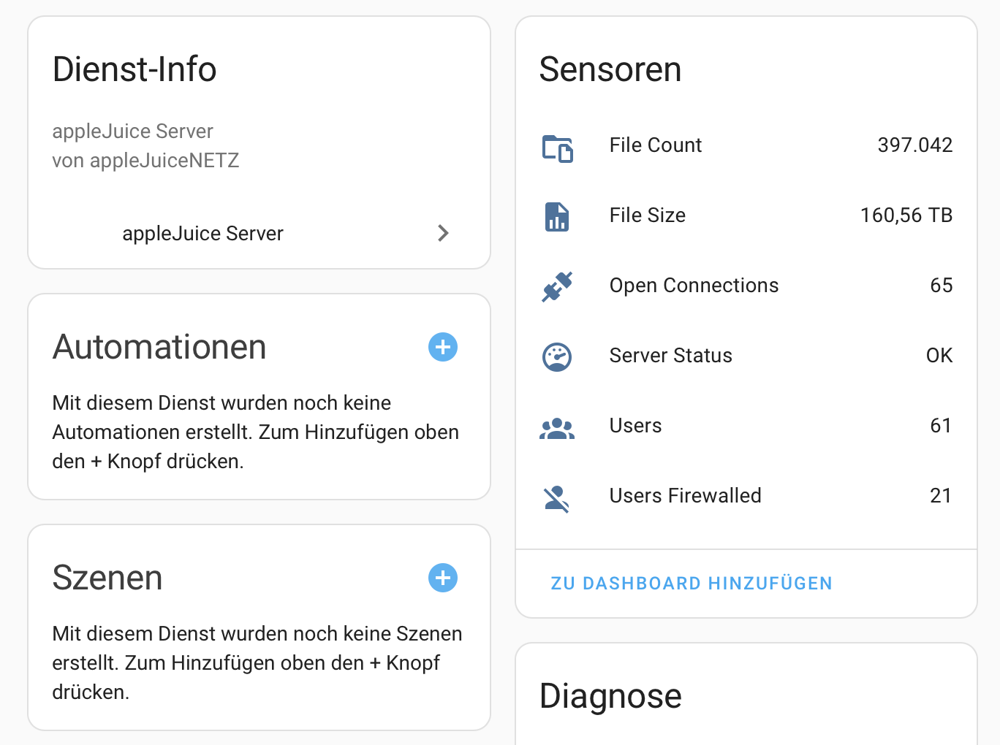
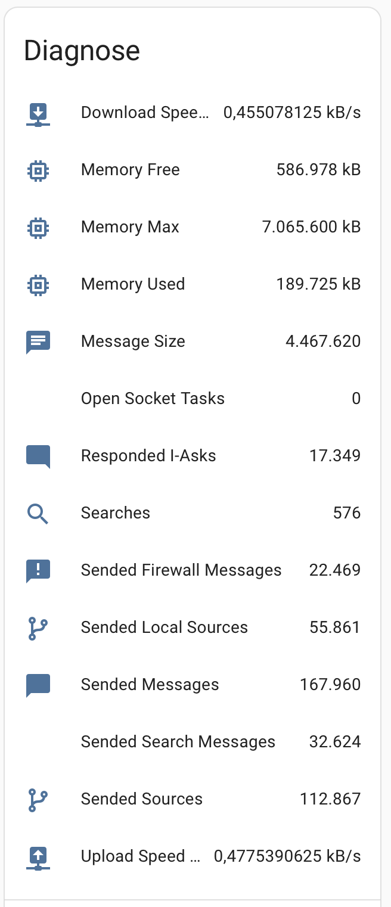
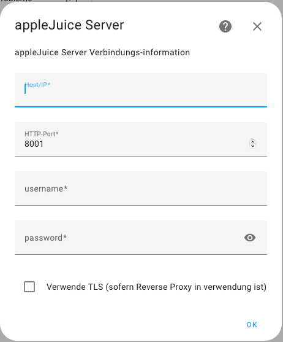

# appleJuice Server Integration für Home Assistant

appleJuice Server Integration für Home Assistant.

# ❗ Achtung ❗

Diese Integration kannst du nur verwenden, wenn du einen appleJuice Server betreibst.

## Installation

1. Öffnen [HACS](https://hacs.xyz) in Home Assistant

2. Klicke auf die drei Punkte in der oberen rechten Ecke und wähle "Benutzerdefinierte Repositories"

3. Füge ein neues benutzerdefiniertes Repository hinzu:

    - **URL:** `https://github.com/applejuicenetz/ha-applejuice-server`

    - **Kategorie:** `Integration`

4. Klicke auf `Hinzufügen`

5. Klicke die `appleJuice Server` Integration

6. Klicke auf `HERUNTERLADEN`

7. starte `Home Assistant` neu

8. Navigiere zu `Einstellungen` - `Geräte & Dienste`

9. Klicke auf `INTEGRATION HINZUFÜGEN` und wähle die `appleJuice Server` Integration

10. Gib `Host/IP`, `Web-Port`, `Username` und `Passwort` ein und klicke auf `OK`

## Screenshot

